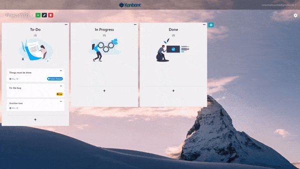
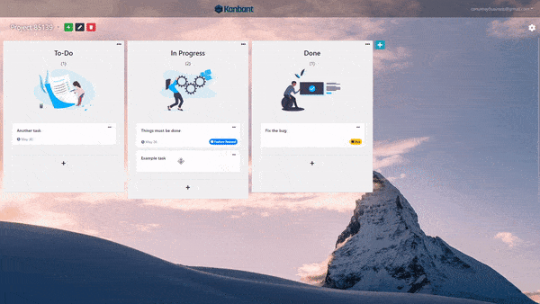
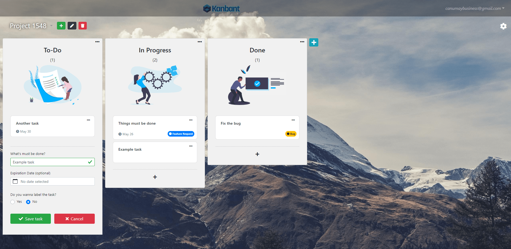
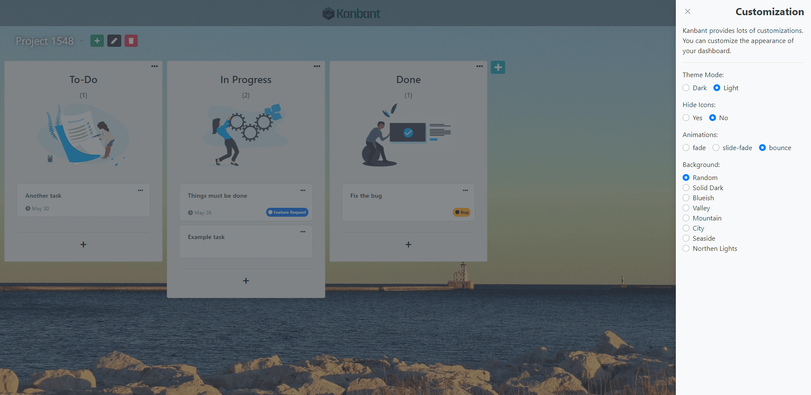
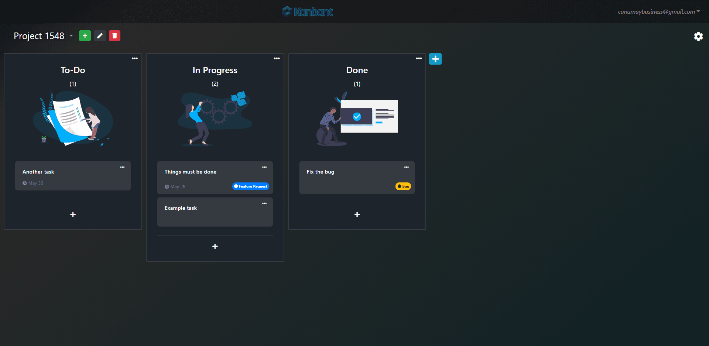

> Open Source Kanban Board project built with Vue.js, Node.js, Express.js and MongoDB

Kanbant's motto is to make Kanban simple again, so you won't see any complicated pages anymore, just your tasks, and that's it.

## [Demo](https://kanbant.herokuapp.com/login)

## Gifs

|  Creating a task | Dragging a task  |
| ------------- | ------------- |
|   |   |

|  Cloning a task | Cloning a column  |
| ------------- | ------------- |
|  |   |

## Screenshots






## Roadmap:

 * [x] Suitable for personal use
 * [ ] Login with social media accounts
 * [ ] App Notifications
 * [ ] Mail Notifications
 * [ ] Suitable for team use (task assignment, privileges etc.)
 * [ ] Slack integration

## Development setup

Clone the repository

```sh
git clone https://github.com/canumay/kanbant.git
cd kanbant
```

Install dependencies and run app server with development mode

```sh
npm install
npm run dev
```

Install dependencies & serve frontend for development build

```sh
cd client
npm install
npm run serve
```

Navigate to http://localhost:8080, if you're seeing Kanbant login page, everything is OK!

## Deployment Setup

Preparing frontend assets for production deployment:

```sh
cd client
npm install
npm run build
```
NOTE: Building process creates files and assets in the ```client/dist``` directory.

If you want to use external MongoDB database, create environment file (.env) and change its content like below.

```
MONGO_DB_URI=<YOUR-MONGO-DB-URI>
```

## Meta

Can Umay – [@canumaytw](https://twitter.com/canumaytw) – canumaybusiness@gmail.com

Distributed under the MIT license. See ``LICENSE`` for more information.

[https://github.com/canumay/kanbant](https://github.com/canumay/)

## Contributing

1. Fork it
2. Create your feature branch (`git checkout -b feature/fooBar`)
3. Commit your changes (`git commit -am 'Add some fooBar'`)
4. Push to the branch (`git push origin feature/fooBar`)
5. Create a new Pull Request
